# AWS Management Console CLI

#### Jose Felipe Flores da Silva

#### Student number: R00293192

#### [GitHub Repository](https://github.com/JFelipeFloresS/AWSBoto3CloudAutomationAndOrchestration)

## DEPENDENCIES

This project requires the Python packages listed in [requirements.txt](requirements.txt).

To install the required packages, run one of the commands (depending on your Python installation) in your terminal:

- ```
    pip install -r requirements.txt
    ```
- ```
    pip3 install -r requirements.txt
    ```

## ENVIRONMENT VARIABLES

The file [usercred.txt](usercred.txt) contains the user credentials in the following format:

```
AWS_ACCESS_KEY_ID={your_aws_access_key_id}
AWS_SECRET_ACCESS_KEY={your_aws_secret_access_key}
EC2_RDP_PASSWORD={your_ec2_rdp_password} # this is not actually used in the code
RDS_MASTER_USERNAME={your_rds_master_username}
RDS_MASTER_PASSWORD={your_rds_master_password}
```

The utility [credentials_handler](src/utils/credentials_handler.py) provides access to these environment variables.

## RUNNING THE APPLICATION

To run the code, execute one of the following commands in your terminal (depending on your Python installation):

- ```
    python src/main.py
    ```
- ```
    python3 src/main.py
    ```

Make sure you have the required packages installed and the [usercred.txt](usercred.txt) file properly configured before
running the
code.

## USER INPUT

This is a command-line application that requires user input during execution. Follow the prompts in the terminal to
provide the necessary information.

When a list is provided, you can either type the value directly or select from the numbered options displayed.
For example, if prompted to select an option from a list:

```
Select an option:
1. Option A
2. Option B
3. Option C
```

You can either type "Option A" or just "1" to select it.

If a default value is provided in the prompt, you can simply press Enter to accept the default.
For example, if prompted:

```
Enter your name [Default: John Doe]:
```

Pressing Enter without typing anything will select "John Doe" as the input.

You can cancel any operation at any time by typing "cancel" and pressing Enter. This will abort the current process and
return you to the main menu or exit the application, depending on the context.

On any inner menu, typing "Main menu" or the corresponding number for the main menu option will take you back to the
main menu.

On any menu, typing "exit" or the corresponding number for the exit option will terminate the application.

## DEFAULT REGION

The default region for all services is `eu-west-1`. You can change the region in the code if needed by changing the
constant `DEFAULT_REGION` in [Resources](src/model/Resources.py).

## FEATURES


The application provides the following features:

- Elastic Compute Cloud (EC2) Management
    - 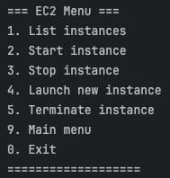
- Elastic Block Store (EBS) Management
    - 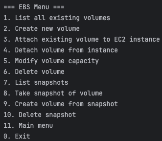
- Simple Storage Service (S3) Management
    - 
- CloudWatch Monitoring and Alarms
    - 
- Relational Database Service (RDS) Management
    - 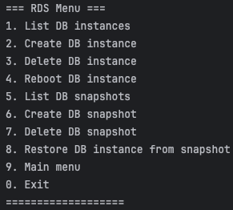

### EC2 Management

The EC2 Management feature allows you to:

- List all EC2 instances
    - 
- Start an EC2 instance
    - 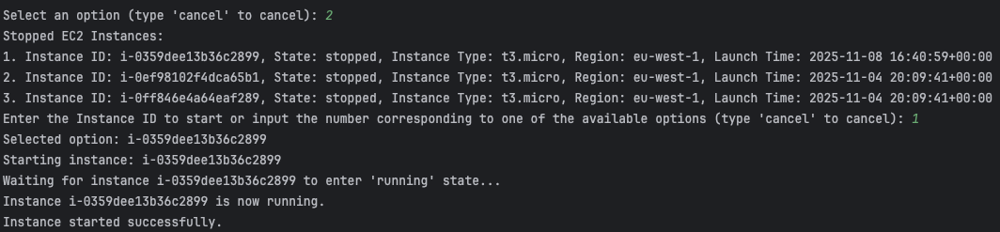
    - 
- Stop an EC2 instance
    - 
- Launch a new EC2 instance
    - 
    - 
- Terminate an EC2 instance
    - 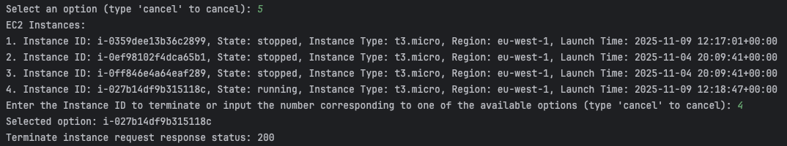
    - 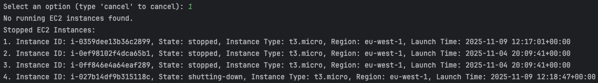

### EBS Management

The EBS Management feature allows you to:

- List all existing EC2 volumes
    - 
- Create a new EC2 volume
    - 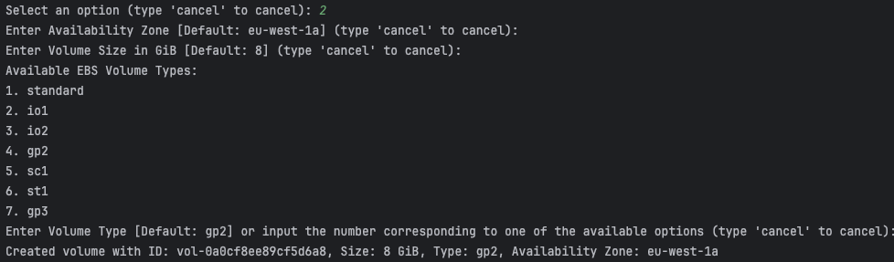
    - 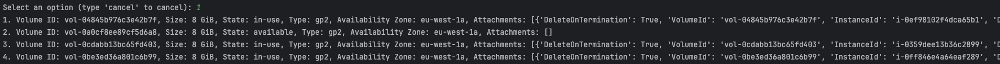
- Attach existing EC2 volume to an EC2 instance
    - 
    - 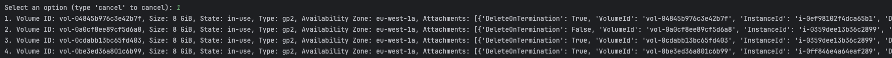
- Detach an EC2 volume from an EC2 instance
    - 
    - 
- Modify an EC2 volume's capacity
    - 
    - 
- Delete an EC2 volume
    - 
    - 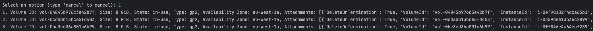
- List all EC2 volume snapshots
    - 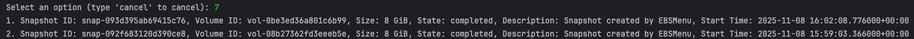
- Take snapshot of an EC2 volume
    - 
    - 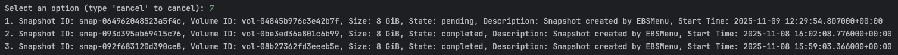
- Create a new EC2 volume from an EC2 volume snapshot
    - 
    - 
- Delete an EC2 volume snapshot
    - 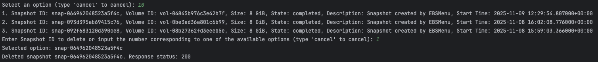
    - 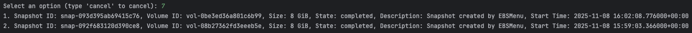

### S3 Management

The S3 Management feature allows you to:

- List all S3 buckets
    - 
- List all objects in a given S3 bucket
    - 
- Upload an object to an S3 bucket
    - 
    - 
- Download an object from an S3 bucket
    - 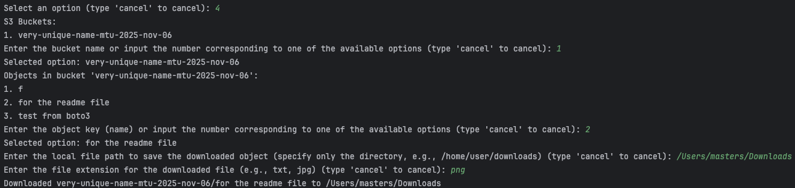
    - 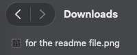
- Delete an S3 bucket
    - 
    - 
- Create a new S3 bucket
    - 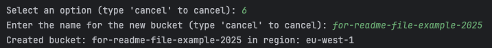
    - 

### CloudWatch Monitoring and Alarms

The CloudWatch Monitoring and Alarms feature allows you to:

- Get DiskReadOps and CPUCreditUsage performance metrics for an EC2 instance
    - 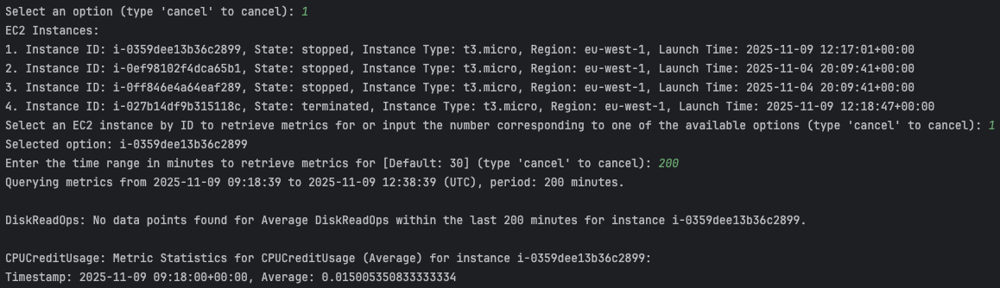
- Set a DiskWriteBytes Alarm for an EC2 instance so that the instance is stopped when the alarm is triggered
    - 

### RDS Management

The RDS Management feature allows you to:

- List all RDS DB instances
    - 
- Create a new RDS DB instance (takes a while to complete)
    - 
    - 
- Delete an RDS DB instance
    - 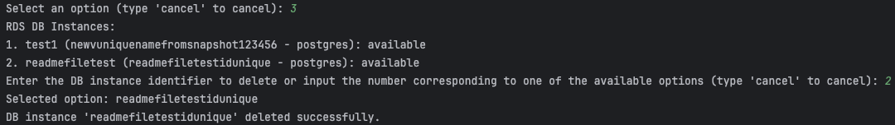
    - 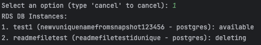
- Reboot an RDS DB instance (takes a while to complete)
    - 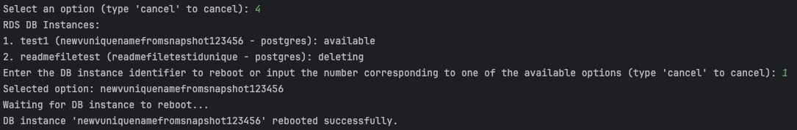
- List all snapshots of RDS DB instances
    - 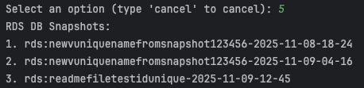
- Create a snapshot from an RDS DB instance (takes a while to complete)
    - 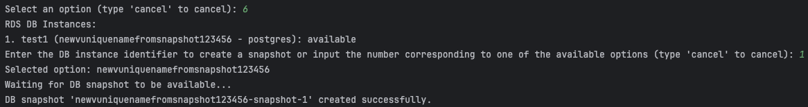
    - 
- Delete a snapshot of an RDS DB instance
    - 
    - 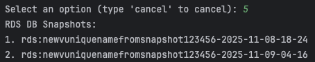
- Restore an RDS DB instance from a snapshot of an RDS DB instance
    - 
    - 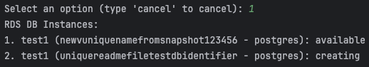